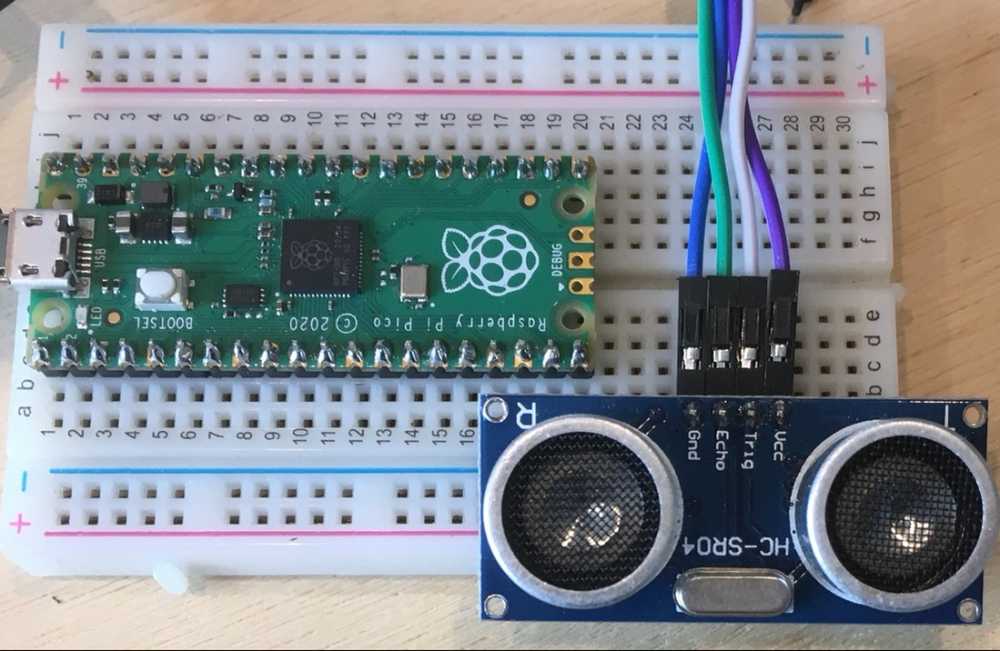

Raspberrypi_Pico.md -\> ~/Dev/AppDev/Raspberrypi_Pico/README.md

# Raspberrypi_Pico


## Run at boot setting

If you want to run your Raspberry Pi Pico without it being attached to a computer,
you need to use a USB power supply.
Safe operating voltages are between 1.8V and 5.5V.
To automatically run a MicroPython program,
simply save it to the device with the name `main.py`


### reset Pico

https://nuneno.cocolog-nifty.com/blog/2021/03/post-c5ccb6.html

**No.30**ピン**RUN**を**LOW**(0V)にするだけで**リセット**出来る。
**No.28**ピンが**GND**で**タウトスイッチ**を乗せられる


## LED

### led.py


1. LEDをブレッドボードにつなぐ
2. pinを登録する
3. pinから出力する。出力を止める
4. 繰り返す
5. 順に点灯させる


### led_def.py

`led.py`を関数化する

1. いきなり5このledを関数化するのではなく、`led.py`のおさらいを兼ねて、まずpin1個分関数化する
2. 理解度を見ながら、以降のpinのon/offを自分で書かせる


### led_button.py


## Button

### ボタンの仕組み


### led_button_1.py

ボタンを押すとLED点灯、離すと消灯

1. ボタン登録
2. button.value() の取得
3. ボタンを自分で複数登録


#### led_button_1_def.py

1. `led_button_1.py`を関数化
2. 関数化して、複雑な点灯パターンを作る


### led_button_2.py ==難易度高め==

おすたびにオンオフが切り替わるタイプのボタン


ボタンを1回押すと点灯、もう一回押すと消灯

1. ボタントグルの原理を理解する
    1. 押しっぱなしだと点滅
    2. 押しっぱなしにしても不点滅 ==難易度高め==
2. button.value() の取得
3. ボタンを自分で複数登録
4. ヴァイブレーションモーターのオンオフ、タイマー設定


#### led_button_2_1.py

- `is_on` をbool から int に変更して、押すたびに点灯するLEDを変更する


#### led_button_2_def.py

1. `led_button_2.py`を関数化
2. 関数化して、複雑な点灯パターンを作る


## PWM

### led

#### led_pwm.py

pwmを使って、LEDの明るさを変化させる

1.


### servo

#### servo_pwm.py

- 赤色の線はpin40のVBUSに、黒色の線はGNDに、黄色の線はpin1のGP0に繋いでいます。
- **sg90の動作電圧が5V**なので、VBUS(5V)に繋ぐ必要があります。
- led_pwm.pyをコピーして、以下以外、同じコードで同じ動きになるか確認する
- 1200〜10000程度の範囲で、徐々に動かす
- 角度とパルスを計算する。
- 0度、90度、180度の角度に対応するパスルを調べる

```python
servo.freq(50)
```


#### servo_pwm_2.py

- `servo_pwm.py`をコピーし、パルスを直接`servo.duty_u16()`に代入して実際にその角度になるか確認。

- 他に、45,135度に対応するパスルを計算する。

  ```python
  _0 = 1400
  -90 = 5000
  _180 = 8100
  ```


#### servo_pwm_button.py

- ボタンを登録。0,90,180度にボタンを対応させる
- 2つ押したときに、中間の角度(45,135度)になるようにする。(条件分岐の書き方に注意)


```python
if button_1.value() == True & button_2.value() == True:
    val = _45
elif button_2.value() == True & button_3.value() == True:
        val = _135
elif button_1.value() == True:
            val = _0 
```


#### servo_pwm_button_2.py

- 物理配線

- 3Dプリントでパーツ作成

- pythonコーディング

    - ボタン登録

    - サーボ登録

    - 挙動

      ```python
      if button_1.value() == True:
          deg_1 += val
          print(deg_1)
      elif button_2.value() == True:
          deg_1 -= val
          print(deg_1)
      ```


## 7 Segment LED Display


### led_display.py

- 物理配線&ピン登録：abcdefgh とピン番号の対応をわかりやすくすることを意識しながら行う。
- コーディング：
    - led_def.pyのときの要領でコーディングする


### _list.py

- led_digit_list.pyに入る前のリストの使い方の導入
    - 1次元
    - 2次元
    - リストをforループで使う


### led_digit_list.py

- 物理配線&ピン登録：abcdefgh とピン番号の対応をわかりやすくすることを意識しながら行う。
- コーディング：
    - 数字と記号をリストを使ってわかりやすく管理する
    - 表示するための関数をわかりやすく作る
    - カウントダウンする


### led_display_double.py

- LEDを2つにして2桁の数字を表示させる
-


### led_display_button.py

- スタート、ストップ機能
-


## アナログ入出力

### Photo sensor

#### photo_sensor.py

- ボタンの登録、明暗の変化と`print`される値の確認


#### photo_sensor_2.py

- ledを登録して、photo sensor の値をledに与える


#### photo_sensor_3.py

- ledの代わりにservoを登録して、photo sensor の値をservoに与える


### Buzzer

#### pwm/buzzer.py


### variable resistance

#### analog/dial.py

微妙なダイアルの回転で値が大きく変わる。


### Infrared Sensor

#### infrared_distance.py


#### infrared_sensor.py


#### infrared_dome_module.py

Mocule's VCC connect to Pico's 5V.


### Ultra Sonic Sensor

#### ultra_sonic/ultra_sonic_1.py ==not works==

not works. not found the solution yet.

https://www.tomshardware.com/how-to/raspberry-pi-pico-ultrasonic-sensor




### 4 legs led

#### led_multiple_color/change_color.py ==not works==

Because

- My led is "common anode".
- "common anode" needs adjustable ground, but pico can not.


